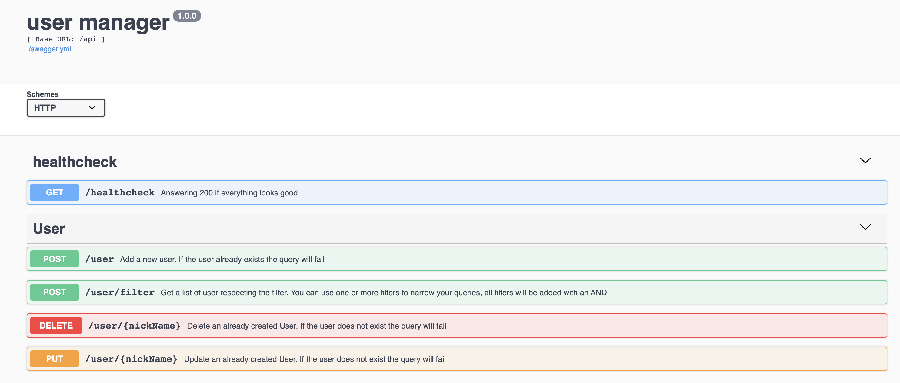

User manager
-
This is an example of how to create a User manager service using:

 - go-swagger as api Framework (OpenAPI 2.0)
 - swagger-ui as frontend to publish documentation and provide a way to test APIs
 - The storage system uses: 
    
    - a mysql database driver, a test DB is provided with the dockercompose
    - a second sql driver `github.com/proullon/ramsql/driver` as in-memory db for unit tests (note that it is not a 100% real db)
    - `https://github.com/DATA-DOG/go-sqlmock` can be used as a driver to create more complex unit tests
 - prometheus is used to expose metrics under `/metrics`
 - an healthcheck is provided under `http://[::]:35307/api/healthcheck`
 - dependencies are managed through `go mod`
 - a messaging system stub is created with channels to decouple the services 
 - logs give an insight on the operation occurring and are leveraging `logrus` (an ID should be created and passed down for each request)
 - `sha256` is computed before storing passwords
 - basic validation checks are performed on payload,`sql injection` should be avoided by design thanks to the sql golang library
 - Api and datamodel are documented in swagger-ui and centralised in the `swagger-ui/swagger.yml` file
 - Users can be added, deleted or modified. The nickname has to be unique
 - A list of user can be retrieved, note that you can pass a filter deciding to include or to exclude any combination of values.
 - Both storage and the messaging system is passed by interfaces to make testing easier

The code **NOT** generated by the swagger framework is included in the following packages/files:

   - `restapi/operation/configure_user_manager.go` file (linking pieces)
   - `messagingSystem` package (logic of messaging system stub)
   - `storage` package (logic of storage)
   - `middlewares` package (logic to redirect, prometheus)
   - `user_implementation` package (logic of APIs)
   - `healthcheck_implementation` package (logic of APIs)
   - `swagger-ui/swagger.yml` file (open-api definition, used to auto-generate the code)

The code autogenerated is NOT covered by tests, everything else has a couple of unit tests to show 
how interfaces, and the in-memory db can be used to test the whole code




Development:
-

To add new Api modify `swagger-ui/swagger.yml` and run:
 
 `$swagger generate server  -f ./swagger-ui/swagger.yml --exclude-main`

Be aware, if you modify any autogenerated file it will be overwritten running such command.

Run test running:
  `$go test ./...`


Usage with dockerCompose
-

Start the service and the `mysql` database running:
`docker-compose up --build`

The user manager service will restart till the database is ready. 

Navigate to `http://localhost:35307/swagger-ui/` to visualise the UI and test APIs with a frontend
Navigate to `http://localhost:35307/metrics` to check metrics, in particular `user_created` keeps track of the number of user created since the restart

You can connect to the db directly to debug issues: `mysql --host=127.0.0.1 --port=3307  -u root -p`
If you do not want to use the UI you can connect directly to the endpoint with `curl` or any other tool:
```bash
curl -X POST "http://[::]:35307/api/user" -H "accept: application/json" -H "Content-Type: application/json" -d "{ \"firstName\": \"paolo\", \"secondName\": \"gallina\", \"nickName\": \"gallocedrone\", \"password\": \"supersecurepassword\", \"email\": \"paologallina@gmail.com\", \"country\": \"Italy\"}"
curl -X POST "http://[::]:35307/api/user/filter" -H "accept: application/json" -H "Content-Type: application/json" -d "{ \"include\": { \"firstName\": \"paolo\", \"secondName\": \"gallina\", \"nickName\": \"gallocedrone\", \"email\": \"paologallina@gmail.com\", \"country\": \"Italy\" }}"
curl -X DELETE "http://[::]:35307/api/user/gallocedrone" -H "accept: application/json"
curl -X PUT "http://[::]:35307/api/user/g" -H "accept: application/json" -H "Content-Type: application/json" -d "{ \"firstName\": \"paolo\", \"secondName\": \"gallina\", \"nickName\": \"gallocedrone\", \"password\": \"supersecurepassword\", \"email\": \"paologallina@gmail.com\", \"country\": \"Italy\"}"
```

Usage
-

To execute the server clone the repo, cd into it and run:

`$go run ./cmd/user-manager-server/main.go --port 35307`


Improvements needed
-

 - each request should have an ID assigned and logs should include it in the formatted message
 - validation should be improved
 - tests should grow in number, and integration tests with docker-compose should be used to test the whole solution
 - the solution can be scaled vertically and horizontally, the frameworks automatically spawn new goroutines for each connection
 - Metrics should be added to cover more interesting data and help debug issues
 - the messaging system could become a bottleneck, it might be helpful creating a pool of goroutines instead of a unique one to deal with network latency
 - Most option should be configured by Environment variables, currently it is not possible